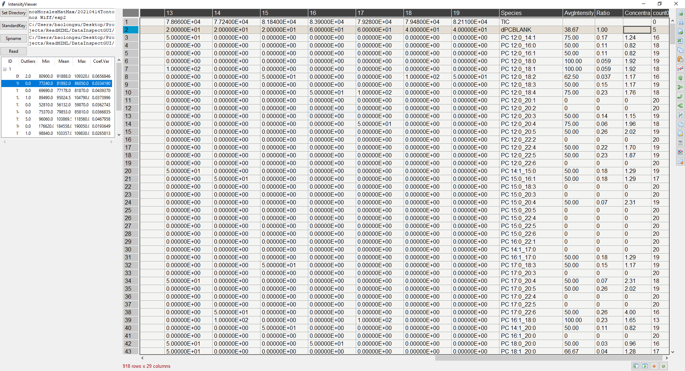

# IntensityViewer
Read mzml data from Sciex LWM or <a href="https://github.com/syjgino/SLA">SLA</a> style shotgun lipidomic run. The code is designed to read result with 20 intensity scans per species. Column "count" is the number of 0s or missing values among the 20 acquisitions.

